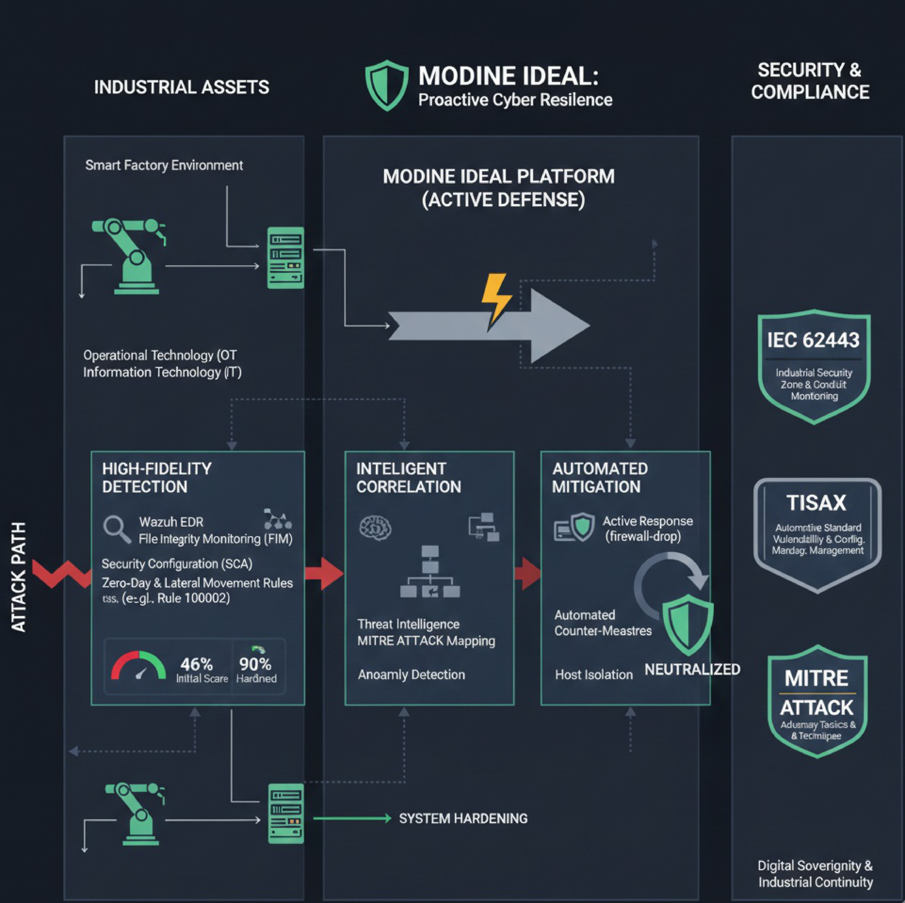

# 🛡️ MODINE IDEAL
**Comprehensive Threat Intelligence Platform: Detection, Active Response & Industrial Resilience**

)

## 🌐 Project Vision
**MODINE IDEAL** is a next-generation cybersecurity ecosystem designed for **Digital Sovereignty** and **Industrial Continuity**. It moves beyond passive monitoring into an **Active Defense & Resilience model**, integrating high-fidelity detection with automated, standards-compliant mitigation strategies.

> **🎯 The Mission:**
> Instead of just observing attacks, **MODINE IDEAL** proactively neutralizes them. By mapping technical actions to global frameworks (MITRE ATT&CK & IEC 62443), we ensure that the "Counter-Measure" is precise, automated, and strictly aligned with enterprise safety protocols.

> In real-world assessments, many environments start with a **Security Configuration Assessment (SCA) score of less than 50% (e.g., 46%)**. 
> **MODINE IDEAL** bridges this gap, hardening systems to enterprise-grade standards through continuous monitoring and automated mitigation.

---

## 🛠️ System Architecture
MODINE IDEAL is not just a lab tool; it's a **Comprehensive Threat Intelligence Platform**. It analyzes behavioral patterns to neutralize threats in real-time before they escalate.

### 🧩 Core Mechanisms:
1. **Behavioral Heuristics (Rules 12-15):** Specialized in detecting **Zero-Day** and **Zero-Click** attacks (Lateral Movement).
2. **Automated Counter-Attack:** Proprietary **Active Response** scripts that block malicious IPs and isolate compromised hosts instantly.
3. **Admin-Safe Logic:** Intelligent context-aware whitelisting ensures that legitimate Administrative actions are never interrupted.

---

## 🏭 Industry 4.0 & Global Compliance
The platform is specifically architected to support **Smart Manufacturing** and the **Automotive Supply Chain**, aligning with international security standards:

* **🛡️ IEC 62443 Alignment:** Protecting Industrial Control Systems (ICS) by monitoring Zone-to-Zone lateral movement and ensuring File Integrity (FIM) of PLC configurations.
* **🚗 TISAX Ready:** Meeting the high-security requirements for the Automotive industry in Morocco (e.g., Stellantis/Renault ecosystems) by ensuring data confidentiality and continuous audit trails.
* **⚙️ Business Continuity:** Optimized for low-latency environments to ensure security never impedes production line efficiency (Zero-Downtime focus).

---

## 🛡️ Compliance Mapping & Proof of Concept (PoC)

To demonstrate how **MODINE IDEAL** aligns with global standards, we map our technical features to specific regulatory requirements:

| Standard | Requirement | MODINE IDEAL Implementation (The Proof) |
| :--- | :--- | :--- |
| **IEC 62443** | Zone & Conduit Monitoring | **Zero-Click Detection:** Rules (100002) track lateral movement between network segments using Sysmon telemetry. |
| **TISAX** | Vulnerability & Config Management | **SCA Module:** Continuous auditing against CIS Benchmarks with automated gap analysis (The "SCA Score" mechanism). |
| **ISO 27001** | Threat Detection & Incident Response | **Active Response:** Automated "Counter-Attack" (firewall-drop) to mitigate threats within seconds (Annex A.16). |
| **Industry 4.0** | Integrity of Industrial Assets | **FIM (File Integrity Monitoring):** Real-time monitoring of sensitive system files and ICS configurations. |

---

## 🔍 Deep Dive: How the Code Proves Compliance
The technical architecture of **MODINE IDEAL** is built to satisfy regulatory requirements directly through its configuration files.

### 1. IEC 62443 (Zone-to-Zone Monitoring)
* **The Code:** `local_rules.xml` (Rule ID: `100002`)
* **How it works:** By using the `<field name="win.eventdata.destinationIp">` filter against internal IP ranges (`^10\.|^192\.168\.|^172\.`), the platform identifies **Lateral Movement**—a key requirement of IEC 62443-3-3 to ensure that a breach in one zone doesn't silently spread to industrial control segments.

### 2. TISAX (Continuous Hardening & SCA)
* **The Code:** `ossec.conf` (Section: `<sca>`)
* **How it works:** TISAX requires verifiable "State of the Art" configurations. Our configuration sets a `<interval>12h</interval>` scan. This provides a continuous **Audit Trail** and a "Hardening Score" against **CIS Benchmarks**, which serves as direct evidence for TISAX auditors during a security assessment.

### 3. ISO 27001 (Automated Incident Response)
* **The Code:** `ossec.conf` (Section: `<active-response>`)
* **How it works:** Annex A.16 of ISO 27001 demands timely incident response. **MODINE IDEAL** implements `<command>modine-firewall-attack</command>` triggered by high-level alerts (Level 12+). This demonstrates a "Proactive Defense" posture, reducing the *Mean Time to Respond (MTTR)* to near zero.

### 4. Industry 4.0 (Configuration Integrity)
* **The Code:** `ossec.conf` (Section: `<syscheck>`)
* **How it works:** To protect Smart Factory assets, we use `<directories check_all="yes" realtime="yes">`. This ensures that any unauthorized modification to critical system binaries or Industrial IoT configurations is detected instantly, preventing **Zero-Day** tampering of production lines.

---

## 📂 Project Structure
* `📂 configs/`: Production-ready `ossec.conf` optimized for Wazuh Managers.
* `📂 rules/`: Custom **MODINE-Ruleset** for high-risk threat detection (Zero-Day focus).

---

## 👨‍💻 Developed By
**YOUNESS MODINE**
*SOC Analyst & Cybersecurity IT/OT | GRC : ISO 27001 & TISAX | Industrial Safety*
*Student at **Université Ibn Tofaïl (UIT)** - MOROCCO.*

---
### ⚠️ AVIS IMPORTANT / IMPORTANT NOTICE
* L'utilisation commerciale de ce projet ou de ses fichiers de configuration est strictement interdite sans l'autorisation écrite du Créateur du projet (YOUNESS MODINE).*
* Commercial use of this project or its configuration files is strictly prohibited without written authorization from the Project Creator (YOUNESS MODINE).*
---

